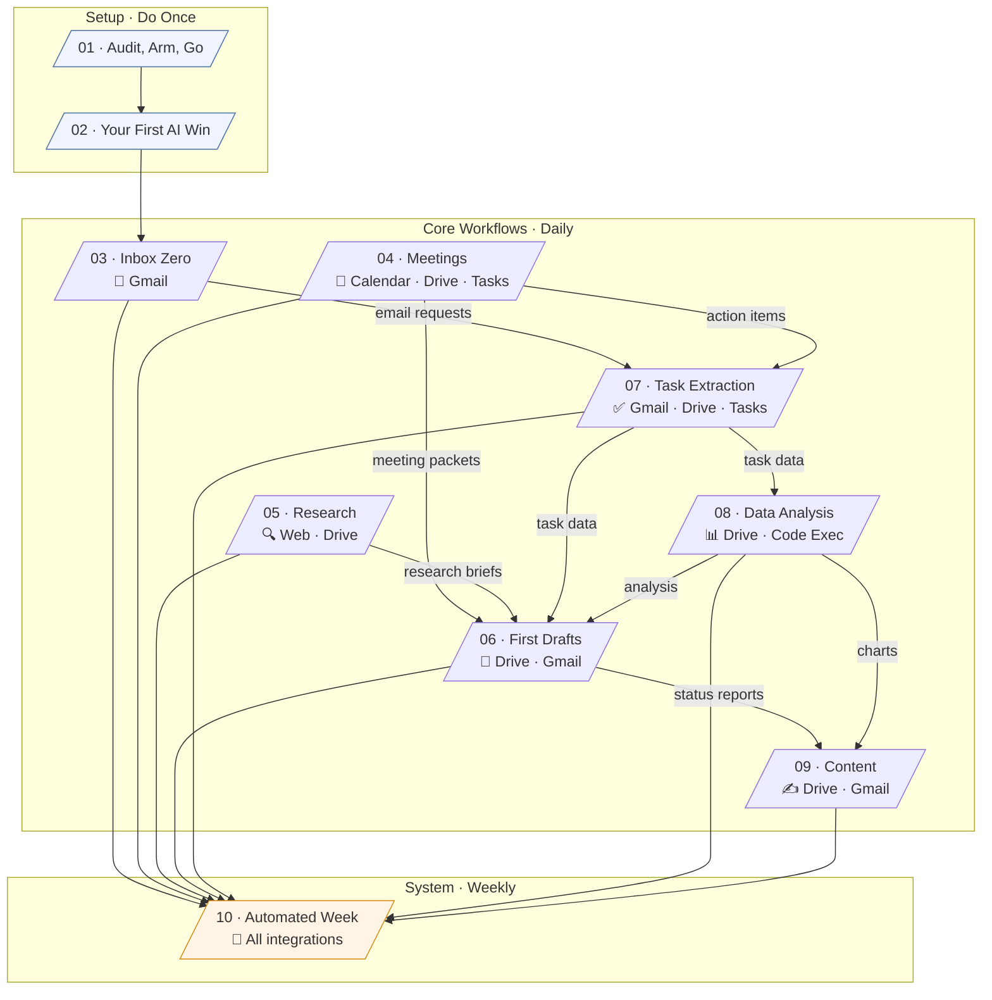
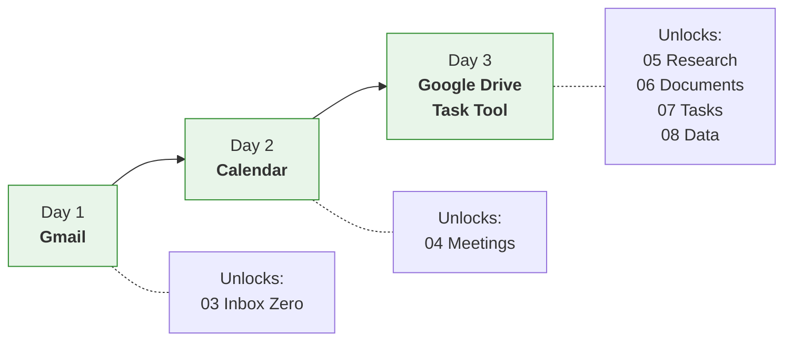
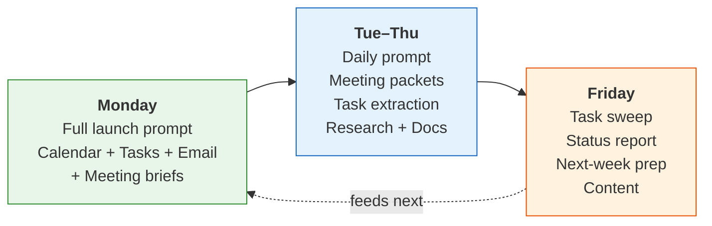

# AI For Everyday Automation — Ready-to-Use Skills

**Companion to *AI For Everyday Automation* by Dipankar Sarkar, published by Packt.**

This collection contains every workflow from the book, packaged as **skills** you can install in Claude, ChatGPT, or Perplexity in under two minutes. Once installed, they work automatically — just talk to your AI tool naturally and the right skill kicks in.

> **No technical knowledge required.** If you can download a file and click "upload," you can install these skills.

---

## What Are Skills?

Skills are instruction sets that teach your AI tool how to do specific tasks. Think of them as training a very capable assistant: you give them a manual once, and from then on, they know how to handle that type of work whenever you ask.

For example, when you install the **Inbox Zero** skill and say *"check my email,"* your AI tool will automatically:
- Read your Gmail inbox
- Sort emails by urgency
- Draft replies in your voice
- Wait for your approval before sending

You do not need to remember any prompts or copy-paste anything. The skill handles it.

---

## Getting Started (2 Minutes Per Skill)

### Step 1: Download the skill you want

Each skill is a small file (a ZIP) you download from this page. You will find them in the **`dist/`** folder above, or in the Releases section. Start with the one that matches your biggest time sink:

| If you spend too much time on... | Download this skill |
|---|---|
| Email | `03-inbox-zero.zip` |
| Meeting prep and follow-up | `04-meetings.zip` |
| Research | `05-research.zip` |
| Writing reports and documents | `06-first-drafts.zip` |
| Tracking tasks and action items | `07-task-extraction.zip` |
| Spreadsheets and data | `08-data-analysis.zip` |
| LinkedIn posts and announcements | `09-content-on-demand.zip` |
| **All of the above** | `all-skills.zip` |

Not sure where to start? Download `01-audit-arm-go.zip` first — it helps you figure out which tasks to automate.

### Step 2: Upload to your AI tool

Pick the AI tool you use most and follow the instructions for that tool:

**Claude (recommended)**
1. Go to [claude.ai](https://claude.ai)
2. Click **Customize** (in the left sidebar) → **Skills**
3. Click the **+** button → **Upload a skill**
4. Select the ZIP file you downloaded
5. Make sure the toggle next to the skill is turned **on**

**ChatGPT**
1. Go to [chat.openai.com](https://chat.openai.com)
2. Click your profile icon → **Skills**
3. Click **New skill** → **Upload from your computer**
4. Select the ZIP file
5. The skill is now active in your conversations

**Perplexity**
1. Go to [perplexity.ai](https://perplexity.ai)
2. Navigate to **Computer Skills**
3. Upload the ZIP file
4. The skill is now available

### Step 3: Connect your work tools (one-time setup)

Most skills work best when your AI tool can read your email, calendar, and documents directly. You only need to do this once:

| Day | Connect this | How | What it unlocks |
|---|---|---|---|
| **Day 1** | **Gmail** | In Claude: Customize → Integrations → Google Gmail → Authorize | Email skill (03) |
| **Day 2** | **Google Calendar** | Same path → Google Calendar → Authorize | Meeting skill (04) |
| **Day 3** | **Google Drive** | Same path → Google Drive → Authorize | Research (05), Documents (06), Data (08) |
| **Day 3** | **Task tool** (Asana, Linear, or Notion) | Same path → search for your tool → Authorize | Tasks (07) |

> **Tip:** You do not need to connect everything at once. Start with Gmail on Day 1 and add more as you go. Each connection takes about 5 minutes.

### Step 4: Start using it

Just talk normally. The skills trigger automatically based on what you say:

- *"Good morning"* → Your AI checks your calendar, email, and tasks and gives you a full briefing
- *"Check my email"* → Reads your inbox, sorts by urgency, drafts replies
- *"I just had a meeting, here is the transcript"* → Produces a summary, creates tasks, emails attendees
- *"Research the competitive landscape for X"* → Searches the web and your documents, produces a sourced brief
- *"Write my weekly status report"* → Pulls data from your meetings, tasks, and emails, writes the report, saves to Drive, emails your manager

You review everything before it is sent. The AI always asks for your approval on emails and tasks.

---

## What Each Skill Does

Here is a quick overview of all 10 skills, which chapter of the book they correspond to, and what triggers them:

| # | Skill | Book Chapter | What it does | Say something like... |
|---|-------|-------------|-------------|----------------------|
| 01 | Audit, Arm, Go | Ch 1 | Identifies which tasks to automate, helps set up your AI tools | *"Help me figure out what to automate"* |
| 02 | Your First AI Win | Ch 2 | Guided walkthrough for your first AI task | *"Help me try AI on a real task"* |
| 03 | Inbox Zero | Ch 3 | Reads, sorts, drafts, and sends email via Gmail | *"Check my email"* |
| 04 | Meetings | Ch 4 | Morning briefs, meeting summaries, action items, task creation | *"What meetings do I have today?"* |
| 05 | Research | Ch 5 | Sourced research briefs using web search + your documents | *"Research the market for X"* |
| 06 | First Drafts | Ch 6 | Writes reports, proposals, memos from your meeting notes and data | *"Write my weekly status report"* |
| 07 | Task Extraction | Ch 7 | Finds hidden tasks in meetings, emails, documents and tracks them | *"What did I commit to this week?"* |
| 08 | Data Analysis | Ch 8 | Cleans, charts, and summarises spreadsheets in plain English | *"Analyse this spreadsheet"* |
| 09 | Content | Ch 9 | Turns one update into LinkedIn posts, announcements, client emails | *"Write a LinkedIn post about this"* |
| 10 | Automated Week | Ch 10 | Runs your full Monday-to-Friday system | *"Good morning" (on Monday)* |

---

## How the Skills Work Together

The skills are designed to feed into each other. A meeting summary (skill 04) becomes input for a status report (skill 06). Tasks extracted from email (skill 07) feed into your project data for analysis (skill 08). Research (skill 05) becomes the backbone of a proposal (skill 06). This is how individual time savings compound into a full system.



---

## Your First Week: Day by Day

You do not need to install everything on Day 1. Follow this schedule and add one new capability each day:



| Day | What to do | Time needed |
|---|---|---|
| **Monday** | Install skills 01 + 03. Connect Gmail. Run the email workflow for the first time. | 30 min |
| **Tuesday** | Install skill 04. Connect Google Calendar. Get your first morning brief. Process your first meeting with AI. | 20 min |
| **Wednesday** | Install skills 05 + 07. Connect Google Drive and your task tool. Try a research task. Extract tasks from a meeting. | 25 min |
| **Thursday** | Install skill 06. Run a document generation chain on a real report or memo. Try skill 08 if you have data to analyse. | 25 min |
| **Friday** | Install skill 10. Run the Friday close — task sweep, status report, next-week preview. Install skill 09 if you have something to announce. Measure your time savings. | 20 min |

By Friday, you have the complete system running. Most people save 8–12 hours in their first full week.

---

## Your Weekly Rhythm

Once everything is set up, this is what a typical week looks like:



| Time | What happens |
|---|---|
| **8:30 AM** | Say *"good morning"* — AI checks your calendar, email, tasks, and gives you a briefing |
| **9:00–9:25** | Review email drafts, approve sends |
| **9:30–12:00** | Deep work. Use research, document, or data skills as needed. After meetings, run the packet + task extraction. |
| **12:30** | Quick 2-minute email scan for urgent items |
| **3:00–3:20** | Second email session |
| **5:00–5:15** | Daily close: check for untracked commitments |
| **Friday PM** | Full weekly close: task sweep, status report, next-week prep |

---

## What If My AI Tool Cannot Connect to Gmail/Calendar?

Every skill works without integrations — you just add a manual step. Instead of the AI reading your email directly, you copy-paste the email into the conversation. Instead of it creating tasks in Asana, you copy the task list and create them yourself.

The skills use identical instructions either way. Connected mode saves 3–5 minutes per task by eliminating the copy-paste. Start with manual mode if your organisation restricts AI integrations, and add connections when they are permitted.

---

## Frequently Asked Questions

**Do I need to install all 10 skills?**
No. Start with the one that saves you the most time. Most people begin with Inbox Zero (03) or Meetings (04). Add more as you get comfortable.

**Can I use these with tools other than Claude?**
Yes. The skill ZIPs work with Claude, ChatGPT, and Perplexity. The workflows and instructions are the same across all three. Some features (like Google Drive integration) may work differently depending on which tool you use — see the book for tool-specific notes.

**Will the AI send emails without my permission?**
No. Every skill that sends an email or creates a task shows you a preview first and waits for your explicit approval. You are always the final gate.

**What if the AI gets something wrong?**
Every skill includes review steps. You check the output before it goes anywhere. The book covers common failure modes (wrong tone, invented facts, misattributed tasks) and how to fix them with follow-up instructions.

**Do I need to pay for AI tools?**
You can follow every workflow using free tiers. Paid tiers remove friction (higher message limits, file uploads, more integrations). Most people find one paid subscription (Claude Pro or ChatGPT Plus) is sufficient.

**How do I update a skill?**
Download the new version of the ZIP and upload it again. The old version will be replaced. Check back here for updated skills as AI tools evolve.

---

## What Is in Each Skill Folder

For those who want to look under the hood, each skill is a simple folder containing:

```
skill-name/
├── SKILL.md            ← The main instruction file. Contains:
│                          • A description that tells the AI when to trigger
│                          • Step-by-step workflow instructions
│                          • Templates and prompt patterns
└── resources/          ← Supporting files (templates, examples)
    └── template.txt       Referenced by the SKILL.md
```

The `SKILL.md` file is plain text — you can open it in any text editor to see exactly what the AI is being told to do. No hidden code, no magic.

---

## For Developers and Advanced Users

If you want to customise the skills or build your own:

- **Edit a SKILL.md** to adjust workflows, add company-specific instructions, or change triggering phrases
- **Add files to `resources/`** to include your own templates, style guides, or reference documents
- **Run `scripts/build-zips.sh`** to regenerate the ZIP files after making changes
- **Share with your team** — on Claude Team/Enterprise plans, skills can be shared organisation-wide via the Skills panel

The `description` field in the YAML frontmatter at the top of each SKILL.md controls when the skill auto-triggers. Edit this to match your team's vocabulary.

---

## All Files in This Collection

```
ai-for-everyday-automation/
├── README.md                          ← You are here
├── LICENSE
├── scripts/
│   └── build-zips.sh                  ← Rebuilds ZIPs after editing skills
├── dist/                              ← Ready-to-upload ZIP files
│   ├── 01-audit-arm-go.zip
│   ├── 02-first-ai-win.zip
│   ├── 03-inbox-zero.zip
│   ├── 04-meetings.zip
│   ├── 05-research.zip
│   ├── 06-first-drafts.zip
│   ├── 07-task-extraction.zip
│   ├── 08-data-analysis.zip
│   ├── 09-content-on-demand.zip
│   ├── 10-automated-week.zip
│   └── all-skills.zip
└── skills/                            ← Source files for each skill
    ├── 01-audit-arm-go/
    │   ├── SKILL.md
    │   └── resources/custom-instructions-template.txt
    ├── 02-first-ai-win/
    │   └── SKILL.md
    ├── 03-inbox-zero/
    │   ├── SKILL.md
    │   └── resources/voice-guide-template.txt
    ├── 04-meetings/
    │   └── SKILL.md
    ├── 05-research/
    │   └── SKILL.md
    ├── 06-first-drafts/
    │   └── SKILL.md
    ├── 07-task-extraction/
    │   └── SKILL.md
    ├── 08-data-analysis/
    │   └── SKILL.md
    ├── 09-content-on-demand/
    │   └── SKILL.md
    └── 10-automated-week/
        ├── SKILL.md
        └── resources/drive-folder-structure.txt
```

---

## License

MIT License — free to use, modify, and share. See [LICENSE](LICENSE).

---

*AI For Everyday Automation* by Dipankar Sarkar
